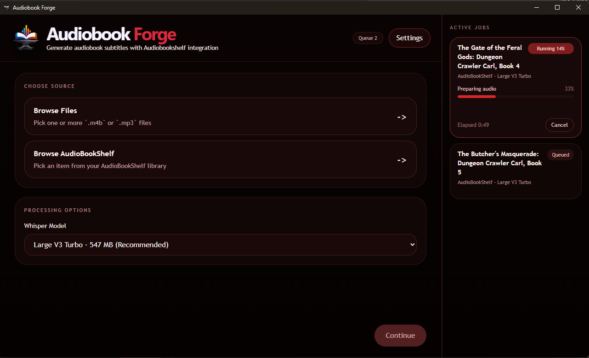

# Audiobook Forge

Audiobook Forge is a Windows desktop companion app for generating audiobook subtitle files with [Audiobookshelf](https://github.com/advplyr/audiobookshelf) integration.

It is built for users who want a focused workflow for selecting books, choosing a Whisper model, queueing subtitle jobs, and generating `.srt` files that can be saved locally or uploaded back into Audiobookshelf automatically.

## Built With AI

Audiobook Forge was built almost entirely through AI-assisted development.

I am not a professional developer, and this project exists because modern AI tools made it possible to design, build, and iterate on an idea that otherwise would have been out of reach.

## Why Audiobook Forge Exists

Audiobookshelf already does the hard work of organizing, hosting, and serving audiobook libraries. Audiobook Forge does not try to replace it.

Instead, Audiobook Forge helps create subtitle files for workflows such as:

- subtitle generation for books that do not already include `.srt` files
- accessibility-focused listening workflows
- read-along playback with subtitle-capable companion apps
- subtitle prep before sending books into a subtitle-first player experience
- library cleanup for books missing subtitle support

## Features

- Generate `.srt` subtitle files from local audiobook files
- Browse and queue books directly from an Audiobookshelf library
- Automatically upload generated subtitles back to Audiobookshelf when possible
- Save subtitles locally for standalone or fallback workflows
- Pick Whisper models from a streamlined desktop UI
- Keep queued, running, completed, failed, and cancelled jobs in one place
- Show whole-run progress, current task progress, elapsed time, and live transcription text
- Split subtitle output across multi-file audiobooks
- Add optional EPUB context to improve vocabulary and proper-name recognition

## Interface Preview

## Quick Start

### Windows Release

Each release is intended to publish two Windows assets to GitHub Releases:

- a Windows installer
- a portable `win-unpacked.zip` build that can be extracted and run from a folder

Recommended install flow:

1. Download the latest release from [GitHub Releases](https://github.com/JCDeSantis/audiobookforge/releases).
2. Choose either:
   - the installer if you want a normal Windows install
   - the unpacked zip if you want a portable folder-based run
3. Launch Audiobook Forge.
4. Open `Settings`.
5. Enter your Audiobookshelf server URL and API key.
6. Pick a default Whisper model.
7. Select either local audiobook files or a book from Audiobookshelf.
8. Queue the job and let Audiobook Forge generate the subtitles.

Portable build note:

- after extracting the portable zip, run `Audiobook Forge.exe` from the unpacked folder

## How To Use It

### Audiobookshelf Workflow

1. Open `Settings`.
2. Enter your Audiobookshelf URL.
3. Enter a user API key from Audiobookshelf.
4. Open the Audiobookshelf browser from the source picker.
5. Filter or sort books, especially with `No SRT first`.
6. Select the book you want.
7. Confirm the Whisper model and optional EPUB context.
8. Add the book to the queue.
9. Let Audiobook Forge transcribe and upload the subtitles back to Audiobookshelf.

### Local File Workflow

1. Choose `Browse Files`.
2. Pick one or more `.m4b` or `.mp3` files.
3. Choose an output folder.
4. Pick a Whisper model.
5. Optionally attach an EPUB.
6. Add the job to the queue.
7. Collect the generated `.srt` files from the selected output folder.

## Security And Privacy Notes

- Audiobook Forge stores the Audiobookshelf API key through the OS credential store using `keytar`
- The API key is not written into the app settings JSON file as plaintext
- Remote Audiobookshelf URLs should use `https://`
- Plain `http://` is only allowed for localhost or private-network Audiobookshelf installs
- Generated subtitles may be saved locally as a fallback if an Audiobookshelf upload fails

## AI Transcription Disclaimer

Audiobook Forge generates subtitles using Whisper-based speech-to-text tooling.

That means subtitle output can include mistakes such as:

- incorrect words
- punctuation errors
- timing drift
- missed speaker changes
- misheard names, places, or invented terms

Generated subtitles should be reviewed before being treated as authoritative, especially for accessibility-sensitive, educational, archival, or public-facing use.

## Companion App

If you want a subtitle-first listening surface after generating subtitle files, see [Spoken Page](https://github.com/JCDeSantis/spoken-page).

Spoken Page is the playback-side companion app for Audiobookshelf users who want synced subtitle-aware listening, while Audiobook Forge focuses on creating the subtitle files themselves.

## How It Works

Audiobook Forge is built as an Electron desktop app with a React renderer and a main-process transcription pipeline.

That pipeline is responsible for:

- storing the Audiobookshelf API key in the OS credential manager
- browsing Audiobookshelf libraries through Electron IPC
- downloading Whisper binaries and model files when needed
- preparing, segmenting, and transcribing audiobook audio
- splitting subtitles across multi-part books
- uploading generated subtitles back into Audiobookshelf when supported

## Release Automation

This repo includes GitHub Actions-based release automation for Windows builds:

- validation workflow: [.github/workflows/ci.yml](.github/workflows/ci.yml)
- release workflow: [.github/workflows/release-windows.yml](.github/workflows/release-windows.yml)

Release behavior:

- Pushes and pull requests run validation
- Version tags such as `v1.0.3` build Windows release assets
- The release workflow uploads both the installer and the portable unpacked zip to GitHub Releases
- Workflow dispatch can be used for manual release builds

## Credits

Audiobook Forge is built specifically to work with Audiobookshelf, and this project would not exist without it.

- Audiobookshelf GitHub: [advplyr/audiobookshelf](https://github.com/advplyr/audiobookshelf)
- Audiobookshelf site: [audiobookshelf.org](https://www.audiobookshelf.org/)
- whisper.cpp GitHub: [ggml-org/whisper.cpp](https://github.com/ggml-org/whisper.cpp)
- OpenAI Whisper GitHub: [openai/whisper](https://github.com/openai/whisper)

Audiobookshelf provides the library, media, and subtitle attachment infrastructure that Audiobook Forge builds on top of.

whisper.cpp provides the local transcription engine and downloadable runtime used for subtitle generation inside the app.

OpenAI Whisper provides the original Whisper model family and model weights that whisper.cpp-compatible workflows are based on.

## Notes

- Audiobook Forge expects an existing Audiobookshelf server when using ABS integration
- Local file transcription works without Audiobookshelf upload
- Audiobook Forge is a companion tool for Audiobookshelf, not a replacement for it
- Audiobook Forge is not affiliated with or endorsed by the Audiobookshelf project

## License

MIT License. See [LICENSE](LICENSE).

For third-party attribution notes, see [THIRD_PARTY_NOTICES.md](THIRD_PARTY_NOTICES.md).
